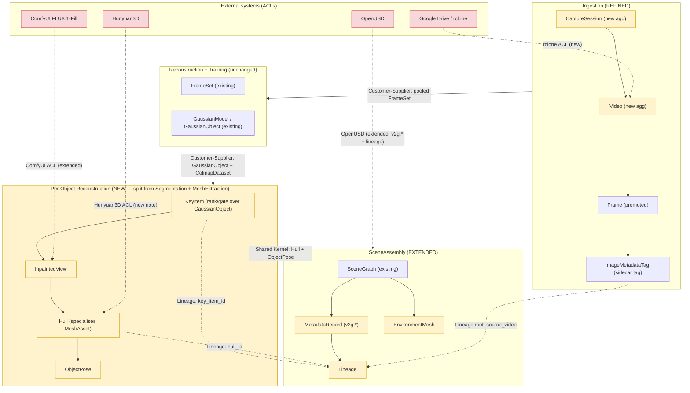

# Domain Model Extensions — v3 End-to-End Closure

**Date**: 2026-06-04
**Status**: Draft

## What this document is

This document **EXTENDS** the existing v2 domain model. It does **not** restate or
rewrite it. It adds new aggregates, entities, value objects, and ubiquitous-language
terms required to close the aspirational end-to-end workflow, traced through the
fourteen deltas (D1–D14) of
[`../decisions/gap-analysis-e2e-aspiration.md`](../decisions/gap-analysis-e2e-aspiration.md)
and the nineteen functional requirements of
[`../decisions/prd-v3-e2e-closure.md`](../decisions/prd-v3-e2e-closure.md).

It builds on, and must be read alongside, the four existing model files:

- [`bounded-contexts.md`](bounded-contexts.md)
- [`aggregates.md`](aggregates.md)
- [`ubiquitous-language.md`](ubiquitous-language.md)
- [`anti-corruption-layers.md`](anti-corruption-layers.md)

It aligns by exact filename with three commissioned decision records (created by a
peer agent; cross-referenced here whether or not they are yet present):
[`adr-009-per-video-ingest-and-metadata.md`](../decisions/adr-009-per-video-ingest-and-metadata.md),
[`adr-010-key-item-hull-recon.md`](../decisions/adr-010-key-item-hull-recon.md),
[`adr-011-usd-metadata-enrichment.md`](../decisions/adr-011-usd-metadata-enrichment.md).

### Exactly what this extension builds on (so nothing is duplicated)

**Existing bounded contexts reused as-is** (from `bounded-contexts.md` §2):
Ingestion, Reconstruction, Training, Segmentation, MeshExtraction, SceneAssembly,
Delivery, and the cross-cutting Orchestration published language. This document
**refines** Ingestion, **splits** a new Per-Object Reconstruction context out of
Segmentation + MeshExtraction, and **extends** SceneAssembly. The other contexts are
untouched.

**Existing root aggregates reused as-is** (from `aggregates.md`):
`ReconstructionJob`, `GaussianModel` (and its `GaussianObject` entity, `AABB`/`Vec3`
value objects), `MeshAsset` (and its `MeshBackend` value object), `SceneGraph` (and
its `ScenePrim`/`UsdCamera` entities, `Transform3D`/`Quaternion` value objects),
`DeliveryArtifact`. The new aggregates here are **owned by, or referenced from**,
these — they do not replace them. In particular:

- `Video` and `CaptureSession` sit **upstream** of `ReconstructionJob`; a
  `CaptureSession` yields exactly one `ReconstructionJob`.
- `KeyItem` is a **refinement of selection over** existing `GaussianObject`s — it does
  not replace `GaussianObject`; it ranks and gates a subset of them.
- `Hull` is a **specialisation of** `MeshAsset` for per-object watertight recon; it
  reuses `MeshBackend` (the `hunyuan3d` instance already enumerated in
  `aggregates.md` §3).
- `MetadataRecord`, `EnvironmentMesh`, and `Lineage` are **added inside** `SceneGraph`.

**Existing ubiquitous-language terms reused, never redefined**: frame (v1
`Frame` entity is promoted here — see note in §1), frame set, blur score, exposure
gate, Fibonacci sampling, viewpoint coverage, COLMAP dataset, registration rate,
splat, Gaussian, PLY, GaussianObject, label, object_id, mask, mask projection,
concept prompt, MeshBackend, watertight mesh, UV atlas, texture bake, prim, prim path,
variant set, UsdPreviewSurface, Xform, sidecar (the **Docker** sense), StageResult,
quality gate, artifact, job, job directory. Where this document needs one of these, it
**uses the existing spelling**. The §4 glossary lists **only genuinely new** terms.

**Existing ACLs reused, never redefined** (from `anti-corruption-layers.md`):
COLMAP ACL, LichtFeld MCP ACL, the Sidecar Container ACL family (MILo/CoMe/
GaussianWrapping), BOUNDARIES.md fork ACL, Blender ACL, ComfyUI ACL. The §5 notes
**extend** the ComfyUI ACL (new per-object inpaint usage), and add adapter notes for
two boundaries the new aggregates newly cross: the **rclone/Drive** boundary and the
**Hunyuan3D** boundary. The OpenUSD boundary is already owned by SceneAssembly; §5
records only the new `v2g:*`/lineage translation responsibility.

> Terminology note — `sidecar` is overloaded by design. In `ubiquitous-language.md`
> it means a companion Docker container (MILo/CoMe). In this document, the
> per-frame metadata file is consistently called a **sidecar tag** (never bare
> "sidecar") to avoid collision. Both spellings are glossed in §4.

---

## 1. Ingestion context — refinement (D1, D2, D3, D14-root)

**Refines** `bounded-contexts.md` §2.1. The Ingestion context today produces a single
pooled `FrameSet` from a session folder (`drive_ingestor.py` `_extract_pooled_frames`).
v3 introduces a **per-video unit of work** and a **per-image provenance record**, while
preserving the existing pooled `FrameSet` as the output handed to Reconstruction.

The crux (from ADR-009): **ingest is per-video, reconstruction is combined.** A room is
captured as several videos; each video is copied, extracted, tagged, and purged
*individually* (so local NVMe never holds more than one raw video — `prd-v3` NFR-3),
but all surviving frames are *pooled* into one `FrameSet` that drives **one** combined
reconstruction. This per-video-ingest / combined-reconstruct tension is modelled
explicitly by making `CaptureSession` the pooling aggregate that owns many `Video`s and
yields one `ReconstructionJob`.

### 1.1 New aggregate root: `Video`

The per-video unit of work. Its lifecycle ledger row (extending the session ledger at
`drive_ingestor.py:137-200` to video granularity) is what makes an overnight batch
resumable and retention-bounded.

```
Video {                              # Aggregate Root (Ingestion)
    id: UUID
    session_id: UUID                 # owning CaptureSession
    source_drive_path: str           # rclone remote path — source of truth, never deleted
    local_scratch_path: Path | None  # NVMe copy; None once purged
    checksum_sha256: str             # verifies the Drive copy and the local copy match
    duration_seconds: float | None
    expected_frame_count: int | None # from duration × fps — used by the verified-extraction rule
    frames: list[Frame]              # extracted Frame entities (this Video only)
    state: VideoState                # value object (lifecycle below)
    created_at: datetime
    error: str | None
}

VideoState {                         # Value Object
    phase: VideoPhase                # pending → copied → extracted → tagged → purged → done | failed
    retained_frame_count: int        # frames surviving the per-video quality gate
    started_at: datetime
    phase_started_at: datetime
}
```

`VideoPhase` lifecycle (the per-video state machine FR-1/FR-7 resume against):

```
pending  → copied   : Video.copy_to_scratch() succeeds, checksum verified
copied   → extracted: frames extracted; retained_frame_count recorded
extracted→ tagged   : an ImageMetadataTag written for every retained Frame
tagged   → purged   : local_scratch_path deleted (retention rule, below)
purged   → done      : Frame contributions merged into the CaptureSession FrameSet
any      → failed    : error set; Drive copy untouched (source of truth survives)
```

### 1.2 Entity: `Frame` (promoted, belongs to a `Video`)

`Frame` already exists in the v1 glossary (`ddd-domain-model.md`) as a loose entity and
appears in `ubiquitous-language.md` Ingestion. v3 **promotes** it to a first-class
entity owned by `Video` (identity matters: a frame must trace to exactly one source
video). It carries no new geometry — only identity and its tag.

```
Frame {                              # Entity (owned by Video)
    id: UUID
    video_id: UUID                   # the owning Video — root of the lineage chain
    frame_index: int                 # index within this Video's extraction
    image_path: Path
    tag: ImageMetadataTag            # value object, written at the `extracted → tagged` transition
    kept: bool                       # survived the per-video quality gate
}
```

### 1.3 Value object: `ImageMetadataTag` (D3, the sidecar tag)

The per-frame provenance record. Persisted as a JSON **sidecar tag** at
`<frame>.json` (FR-3). Immutable once written (NFR-2 idempotency). This value object
**is** the per-image metadata schema; `schema_version` makes it byte-stable (NFR-5).

```
ImageMetadataTag {                   # Value Object — written to <frame>.json
    source_video: str                # Video.id — root of the lineage chain (FR-5)
    capture_session: str             # CaptureSession.id
    frame_index: int
    source_timestamp: datetime | None# capture time if recoverable from container metadata
    blur_score: float                # reuses Ingestion "blur score"
    exposure_score: float            # reuses Ingestion "exposure gate"
    sharpness_score: float
    phash: str                       # perceptual hash — near-duplicate detection
    kept: bool                       # gate decision recorded with the frame
    selection_reason: str            # why kept/dropped: "blur", "exposure", "duplicate", "selected"
    pose_hint: PoseHint | None       # optional slot; backfilled post-COLMAP (see "pose backfill", §4)
    schema_version: str              # e.g. "v2g.frame.1" — fixes the field set (NFR-5)
}

PoseHint {                           # Value Object — optional, backfilled
    camera_position: Vec3 | None     # reuses existing Vec3
    camera_rotation_quat: Quaternion | None  # reuses existing Quaternion
    registered: bool                 # did COLMAP register the source frame
}
```

### 1.4 New aggregate root: `CaptureSession` (the pooling boundary)

Models the per-video-ingest / combined-reconstruct tension directly. Owns many
`Video`s; yields exactly **one** `ReconstructionJob`. The combined `FrameSet` is built
by pooling the retained, tagged `Frame`s of all member `Video`s in the `done` phase.

```
CaptureSession {                     # Aggregate Root (Ingestion)
    id: UUID
    drive_session_path: str          # the remote session folder
    videos: list[Video]              # many — ingested one at a time
    pooled_frame_set_id: UUID | None # the single combined FrameSet (existing artifact)
    reconstruction_job_id: UUID | None # the ONE job this session yields
    state: SessionState
}

SessionState {                       # Value Object
    phase: str                       # ingesting → pooled → reconstructing → done | failed
    videos_total: int
    videos_done: int
}
```

**Invariants**

1. A `CaptureSession` pools frames into its `FrameSet` only from `Video`s whose
   `state.phase == done`. (Per-video completion gates pooling.)
2. At most **one** `Video` per `CaptureSession` may hold a non-null `local_scratch_path`
   at any instant (retention ceiling — `prd-v3` G2 / NFR-3).
3. A `CaptureSession` yields exactly one `ReconstructionJob`
   (`reconstruction_job_id`). The combined reconstruction never runs per-video.
4. `pooled_frame_set_id` is set only after every member `Video` is `done` or `failed`,
   and at least one is `done`.

**Retention as a domain rule** (D2, FR-2). Deletion is not an implementation detail; it
is an invariant of `Video`:

> A `Video`'s `local_scratch_path` is deleted at the `tagged → purged` transition, on
> **verified extraction** only. *Verified* = `retained_frame_count >= 1` **and**
> extracted frame count `>= expected_frame_count` (tolerance per ADR-009). The
> `source_drive_path` is **never** deleted — Drive is the source of truth. A `failed`
> `Video` retains its scratch copy for diagnosis; a `purged` `Video` cannot be
> re-extracted without re-copying from Drive (idempotent: checksum match ⇒ no-op).

**New domain events** (Ingestion):

```
VideoCopied      { video_id, session_id, checksum_sha256, timestamp }
FramesExtractedPerVideo { video_id, extracted_count, retained_count, timestamp }
FramesTagged     { video_id, tag_count, schema_version, timestamp }
VideoPurged      { video_id, freed_bytes, timestamp }       # retention rule fired
SessionPooled    { session_id, frame_set_id, total_retained_frames, timestamp }
```

> Note: the existing `FramesExtracted` event (`aggregates.md`, fired per *job*) is
> retained. `FramesExtractedPerVideo` is the finer-grained per-`Video` event; the
> session-level `FramesExtracted` still fires once at pooling.

---

## 2. Per-Object Reconstruction context — new (D6, D7, D8, D9, D10, D11)

**Split** from the existing Segmentation (`bounded-contexts.md` §2.4) and MeshExtraction
(§2.5) contexts. Segmentation still labels Gaussians and produces `GaussianObject`s;
MeshExtraction still produces full-scene/environment `MeshAsset`s. What is *new* is the
per-object loop that **ranks** segmented objects into key items, **recovers** their
unseen faces, and **reconstructs** a textured watertight hull at its preserved pose.
This is the home of the Hunyuan3D hull path (`stages.py:1778-1806`, "Strategy 1").

**Relationship to existing contexts**: Customer-Supplier downstream of Segmentation
(consumes `GaussianObject`s + masks) and downstream of Reconstruction (consumes the
`ColmapDataset` for depth-aware projection); Shared Kernel with SceneAssembly (supplies
`Hull` + `ObjectPose` for placement). It uses the existing Hunyuan3D and ComfyUI ACLs.

### 2.1 Entity: `KeyItem` (D7 — ranked, selected object)

A `KeyItem` is **not** a new object representation; it is a **ranked selection over** an
existing `GaussianObject`. Today every mask with `mask_pixels>0` is kept
(`stages.py:1410-1419`) and `min_object_gaussians` (`config.py:109`) is never enforced.
`KeyItem` makes keyness a first-class, gated decision.

```
KeyItem {                            # Entity (Per-Object Reconstruction)
    id: UUID
    gaussian_object_id: UUID         # the existing GaussianObject this ranks (never replaces it)
    concept: str                     # the SAM3 concept prompt that detected it (existing term)
    rank_score: float                # composite: size × gaussian_count × confidence × concept_priority
    gaussian_count: int              # per-object Gaussian count (drives the keyness threshold)
    confidence: float                # segmentation confidence (existing GaussianObject.confidence)
    is_key: bool                     # passed the keyness threshold
    hull_id: UUID | None             # set after hull recon
}
```

**Domain rule — keyness threshold**: a `GaussianObject` becomes a `KeyItem` with
`is_key == True` only if `gaussian_count >= config.decompose.min_object_gaussians`
(**enforcing** the previously-dead config knob) **and** `rank_score` is above the
profile-configured keyness cut. Only `is_key` items proceed to hull recon (FR-9, G6/G7).
**keyness** is glossed in §4.

### 2.2 Aggregate root: `Hull` (the reconstructed textured 3D object)

`Hull` is a **specialisation of `MeshAsset`** (`aggregates.md` §3) for per-object
watertight recon. It reuses `MeshBackend` (the `hunyuan3d` canonical instance already
enumerated there) and the existing `watertight mesh` / `texture bake` vocabulary.

```
Hull {                               # Aggregate Root (Per-Object Reconstruction)
    id: UUID
    key_item_id: UUID
    mesh_asset_id: UUID              # the underlying MeshAsset (reuses its GLB/OBJ/texture fields)
    backend: MeshBackend             # reuses existing value object — typically the hunyuan3d instance
    is_watertight: bool              # reuses existing "watertight mesh" invariant
    has_texture: bool                # D11: guaranteed textured (decimate-then-bake or native PBR)
    pose: ObjectPose                 # value object — the data that MUST survive to USD (D9)
    inpainted_views: list[InpaintedView]  # recovered unseen views fed to hull recon (D8)
    created_at: datetime
}
```

**Invariants**

1. A `Hull` exists only for a `KeyItem` with `is_key == True`.
2. `has_texture` must be `True` before SceneAssembly consumes it (D11, FR-13, G11).
   No untextured grey hull is delivered.
3. `pose` is non-identity wherever a real pose was recovered (D9, FR-12, G10); a hull
   never silently lands at origin/identity when pose data exists.
4. Every `InpaintedView` covers a **genuinely unobserved** region (anti-hallucination
   invariant, §2.5).

### 2.3 Value object: `ObjectPose` (D9 — the data that must survive to USD)

The pose persisted from segmentation through to the `ObjectDescriptor` and into the USD
xform. Today it is normalised and **discarded** (`stages.py:1683-1693`) while the
placement machinery (`usd_assembler.py:169-175`) waits for data that never arrives. This
value object is the contract that plumbs it end-to-end. Field names match the existing
consumer (`obj.centroid/rotation_quat/scale`).

```
ObjectPose {                         # Value Object
    centroid: Vec3                   # reuses existing Vec3 — world position
    rotation_quat: Quaternion        # reuses existing Quaternion (XYZW)
    scale: Vec3                      # reuses existing Vec3
    frame: str                       # the coordinate frame: "intra_scene" (v3 contract, FR-8)
}
```

> "Correctly placed" contract (D6, FR-8): `frame == "intra_scene"` — COLMAP-relative,
> Y-up, `SCENE_SCALE=0.5`. Survey/georeferenced placement is explicitly deferred to
> ADR-010 and is **not** a v3 field value.

### 2.4 Value object: `InpaintedView` (D8 — FLUX-recovered unseen view)

A single view recovered by the local FLUX inpainter (`comfyui_inpainter.py:86-107`,
local ComfyUI :3001) for a key item whose orbit render
(`multiview_renderer.py:148-240`) leaves faces unseen, **before** Hunyuan3D hull recon.

```
InpaintedView {                      # Value Object
    view_index: int                  # which orbit view
    recovered_image_path: Path       # the FLUX-inpainted RGB
    coverage_mask_path: Path         # which pixels were genuinely unobserved (the inpaint region)
    coverage_fraction: float         # fraction of the view that was unobserved and recovered
    confidence: float                # inpaint confidence — feeds the anti-hallucination gate
}
```

### 2.5 Domain rule — anti-hallucination invariant (D8)

> **Only genuinely-unobserved regions are inpainted.** A view is eligible for FLUX
> recovery only where its `coverage_mask` marks pixels that no observed frame covers.
> Observed regions are **never** overwritten by the generator. Inpaint is gated behind a
> visible-coverage threshold (FR-11): a key item is recovered only if its observed
> coverage is below threshold, and only the missing region is generated. This is the
> proactive guard (`prd-v3` Risk Register) against plausible-but-wrong hull geometry,
> verified per item by gate G8.

**Depth-aware projection rule** (D10, FR-10): mask→3D assignment is depth-gated, not an
XY-plane majority vote (replacing `mask_projector.py:153-214`), so co-located distinct
objects do not merge into one `KeyItem`'s `GaussianObject` subset (G9).

**New domain events** (Per-Object Reconstruction):

```
KeyItemsRanked   { job_id, ranked_count, key_count, dropped_below_threshold, timestamp }
ViewInpainted    { key_item_id, view_index, coverage_fraction, confidence, timestamp }
HullReconstructed{ hull_id, key_item_id, backend, is_watertight, has_texture, timestamp }
ObjectPosePersisted { key_item_id, centroid, rotation_quat, scale, timestamp }
```

---

## 3. SceneAssembly context — extension (D12, D13, D14)

**Extends** the existing `SceneGraph` aggregate (`aggregates.md` §4) and the
SceneAssembly context (`bounded-contexts.md` §2.6). No existing field is removed; three
additions make the USD self-describing.

### 3.1 Value object: `MetadataRecord` (D12 — the `v2g:*` schema per node)

The namespaced metadata block populated on every node via the (currently unused)
`ObjectDescriptor.metadata` hook (`usd_assembler.py:221-222`). Attribute names are the
`v2g:*` namespace already specified by FR-15. This value object **is** the v3 USD
metadata schema.

```
MetadataRecord {                     # Value Object — populated on a ScenePrim
    semantic_label: str              # v2g:semantic_label   (reuses existing "label")
    quality_score: float             # v2g:quality_score
    bbox_extent: AABB                # v2g:bbox_extent      (reuses existing AABB)
    gaussian_count: int              # v2g:gaussian_count
    recon_method: str                # v2g:recon_method     (e.g. the MeshBackend name)
    confidence: float                # v2g:confidence
    capture_timestamp: datetime      # v2g:capture_timestamp
    processing_timestamp: datetime   # v2g:processing_timestamp
    lineage: Lineage                 # v2g:source_video + v2g:source_frames (§3.3)
    schema_version: str              # v2g schema version (NFR-5 byte-stable)
}
```

> Namespace discipline: existing prims carry `lichtfeld:mesh_path` / `:diffuse_path`
> (`assemble_usd_scene.py:723-725`) — those are **kept**. `MetadataRecord` adds the
> `v2g:*` namespace alongside; it never renames or removes the `lichtfeld:*` attributes.

A `ScenePrim` (existing entity) gains one optional reference:
`metadata: MetadataRecord | None`. **Invariant** (FR-18, G13): every object `ScenePrim`
must carry a fully-populated `MetadataRecord` (all ≥10 required fields) before
`SceneAssembled` fires.

### 3.2 Entity: `EnvironmentMesh` (D13 — textured environment surface)

Today `/World/Environment/Background` holds only a `DomeLight`
(`usd_assembler.py:147-154`) and the full-scene mesh is mis-homed under
`/World/Objects/full_scene` (`assemble_usd_scene.py:619-726`). `EnvironmentMesh`
re-homes the textured polygonal scene surface to `/World/Environment` as a first-class
entity owned by `SceneGraph`.

```
EnvironmentMesh {                    # Entity (owned by SceneGraph)
    id: UUID
    scene_graph_id: UUID
    prim_path: str                   # "/World/Environment/EnvironmentMesh" (re-homed)
    mesh_asset_id: UUID              # the full-scene MeshAsset produced by the mesh_method branch
    has_texture: bool                # textured surface, not a backdrop
    metadata: MetadataRecord         # the environment is annotated too (scene-scope v2g:*)
}
```

**Invariant** (FR-18, G12): a `SceneGraph` for a non-trivial scene must own an
`EnvironmentMesh` with `has_texture == True`; a bare `DomeLight` no longer satisfies the
environment requirement.

### 3.3 Value object: `Lineage` (D14 — Video → Frame → KeyItem → Hull → USD node)

Threads provenance through the whole pipeline so the USD is self-describing without the
pipeline present. Carried inside `MetadataRecord`; resolvable by the FR-19 lineage query.

```
Lineage {                            # Value Object
    source_video: str                # Video.id      → v2g:source_video
    source_frames: list[str]         # Frame.ids     → v2g:source_frames
    key_item_id: str | None          # KeyItem.id (None for the environment)
    hull_id: str | None              # Hull.id    (None for the environment)
}
```

The chain — **Video → Frame → KeyItem → Hull → USD node** — is exactly the lineage
closure measured by `prd-v3` O4/G14. Its root is the `ImageMetadataTag.source_video`
written in §1.3; its leaf is the `v2g:source_video`/`v2g:source_frames` on the
`ScenePrim` here.

**New domain events** (SceneAssembly):

```
MetadataPopulated     { scene_graph_id, prim_path, field_count, schema_version, timestamp }
EnvironmentMeshHomed  { scene_graph_id, prim_path, mesh_asset_id, has_texture, timestamp }
LineageResolved       { prim_path, source_video, source_frame_count, timestamp }  # FR-19 query
```

---

## 4. Ubiquitous Language — NEW terms only

These extend `ubiquitous-language.md`. Existing terms are **not** repeated; where a
definition references an existing term it uses that term's established spelling.

| Domain Term | Definition |
|-------------|------------|
| **Video** | The per-video unit of work in Ingestion: one source video copied from Drive, extracted, tagged, and purged individually, with its own resumable ledger row. Aggregate root. |
| **Frame** | (Promoted) A single extracted image owned by exactly one `Video`; the root identity of the lineage chain. Was a loose v1 entity; now first-class with a `video_id`. |
| **ImageMetadataTag** | The per-frame provenance value object written as a JSON **sidecar tag** at `<frame>.json`: source video, session, frame index, timestamp, quality scores, phash, kept flag, selection reason, pose hint, schema version. |
| **CaptureSession** | The pooling aggregate that owns many `Video`s but yields exactly one combined `ReconstructionJob`; models the per-video-ingest / combined-reconstruct tension. |
| **KeyItem** | A ranked, gated selection over an existing `GaussianObject` that passes the keyness threshold and proceeds to hull recon. Does not replace `GaussianObject`. |
| **keyness** | The composite ranking (size × gaussian count × confidence × concept priority) plus the `min_object_gaussians` floor that decides whether a segmented object is a `KeyItem`; the criterion that drops noise. |
| **Hull** | A textured watertight 3D object reconstructed per `KeyItem` (typically via the Hunyuan3D backend); a specialisation of `MeshAsset` carrying `ObjectPose` and recovered views. |
| **ObjectPose** | The persisted placement value object (centroid + rotation quaternion + scale, in the intra-scene frame) that must survive from segmentation through `ObjectDescriptor` into the USD xform. |
| **InpaintedView** | A single FLUX-recovered view of a `KeyItem`'s genuinely-unobserved faces, with its coverage mask and confidence, fed to hull recon before it runs. |
| **MetadataRecord** | The `v2g:*` namespaced metadata value object populated on every USD node (semantic label, quality, extent, gaussian count, recon method, confidence, timestamps, lineage, schema version). |
| **EnvironmentMesh** | The textured polygonal environment surface re-homed under `/World/Environment`, replacing the bare `DomeLight` backdrop as a first-class scene entity. |
| **Lineage** | The provenance value object threading Video → Frame → KeyItem → Hull → USD node, carried in `MetadataRecord` and resolvable by the lineage query. |
| **sidecar tag** | The per-frame JSON metadata file (`<frame>.json`) holding an `ImageMetadataTag`. Distinct from the Docker-container **sidecar** of `ubiquitous-language.md` — always written as two words. |
| **pose backfill** | The post-COLMAP step that fills a `Frame`'s `pose_hint` (`PoseHint`) once its source frame is registered; turns the optional tag slot into real camera pose. |

**New-term count: 14.**

---

## 5. Anti-Corruption notes — new boundaries the new aggregates cross

These **extend** `anti-corruption-layers.md`. Only boundaries newly crossed by the new
aggregates are noted; existing ACLs (COLMAP, LichtFeld MCP, MILo/CoMe/GaussianWrapping
sidecars, BOUNDARIES.md, Blender) are unchanged.

### 5.1 rclone / Google Drive ACL — new (serves `Video`, `CaptureSession`)

**External system**: Google Drive accessed via rclone with service-account credentials
(`drive_ingestor.py`). **Isolates** the Ingestion context from rclone path conventions,
remote listing format, and credential handling.

| Domain concept | External concept | Translation |
|----------------|------------------|-------------|
| `Video.source_drive_path` | `rclone` remote path | `drive_ingestor` builds and verifies the remote path; the domain sees a `Video`, not an rclone URL |
| `Video.copy_to_scratch()` | `rclone copy <remote> <nvme>` | One-video copy; checksum verified before `pending → copied` |
| `CaptureSession` discovery | `rclone lsjson <session>` | Remote listing → list of `Video`s (one ledger row each) |
| outputs push-back | `rclone copy <nvme> <remote>/outputs/` | Drive stays source of truth; only outputs are pushed back |
| credentials | service-account key | **NFR-4 / FINDING-006**: supplied as a **Docker secret**, never a plaintext env var or image layer; the ACL reads the mounted secret, the domain never sees it |

> Retention rule (§1.4) is enforced **above** this ACL: the domain decides when a
> `Video` is purged; rclone only ever copies, never the authority on deletion.

### 5.2 ComfyUI FLUX ACL — extended (serves `InpaintedView`)

The ComfyUI ACL already exists (`anti-corruption-layers.md` §6) for **background**
inpaint. v3 **adds a new caller**: the per-object recovery loop.

| Domain concept | ComfyUI concept | Translation |
|----------------|-----------------|-------------|
| `InpaintedView` (per key item) | FLUX.1-Fill workflow graph JSON | `comfyui_inpainter.py` substitutes the orbit-view image + coverage mask into the pre-built workflow; result → `InpaintedView` |
| anti-hallucination invariant (§2.5) | mask supplied to the workflow | The ACL passes **only** the unobserved-region mask; observed pixels are never sent for generation — the invariant is enforced at the adapter boundary |
| ComfyUI unavailable | `config.inpaint.enabled = False` | No-op (existing behaviour): key item proceeds to hull recon with whatever views exist; gate G8 records the skip |

### 5.3 Hunyuan3D ACL — new note (serves `Hull`)

**External system**: Hunyuan3D hull recon (`hunyuan3d_client.py:528-685`,
`stages.py:1778-1806` "Strategy 1"). The translation reuses the existing `MeshBackend`
value object (the `hunyuan3d` instance) and the Sidecar Container ACL **family pattern**
of `anti-corruption-layers.md` §3 — `Hull` is the domain result; the raw client output
never leaves the adapter.

| Domain concept | Hunyuan3D concept | Translation |
|----------------|-------------------|-------------|
| `Hull.mesh_asset_id` | Hunyuan3D GLB output | `hunyuan3d_client` returns a GLB; adapter wraps it as a `MeshAsset`, then `Hull` |
| `InpaintedView[]` | 4-view orbit input | Recovered views (§2.4) are passed as the multiview input; the domain supplies completed views, not raw renders |
| `Hull.has_texture` guarantee | vertex-colour GLB / bake | D11: adapter runs decimate-then-bake when faces exceed the bake ceiling so `has_texture` is always `True` before the domain sees the `Hull` |

### 5.4 OpenUSD — extended responsibility (serves `MetadataRecord`, `EnvironmentMesh`, `Lineage`)

The OpenUSD boundary is already owned by SceneAssembly (`usd_assembler.py`, and the
LichtFeld MCP ACL for native USD). v3 adds **one** translation responsibility, no new
ACL module:

| Domain concept | USD concept | Translation |
|----------------|-------------|-------------|
| `MetadataRecord` | `v2g:*` prim attributes | `usd_assembler` writes each field as a namespaced attribute via the `ObjectDescriptor.metadata` hook; `lichtfeld:*` attributes are preserved alongside |
| `EnvironmentMesh` | `UsdGeomMesh` at `/World/Environment` | Re-homed from `/World/Objects/full_scene`; reuses existing `UsdGeomMesh` + `UsdPreviewSurface` translation |
| `Lineage` | `v2g:source_video` / `v2g:source_frames` | Written as prim attributes; the FR-19 lineage query reads them back — round-trip stable (NFR-5) |

---

## 6. Context map — new and extended contexts



**Reading the map**: the lineage chain (dotted, bottom) — `Video.source_video` →
`KeyItem.key_item_id` → `Hull.hull_id` → `Lineage` on the USD node — is the spine that
makes every delivered prim resolvable to its source video and frames (D14, O4, G14).
