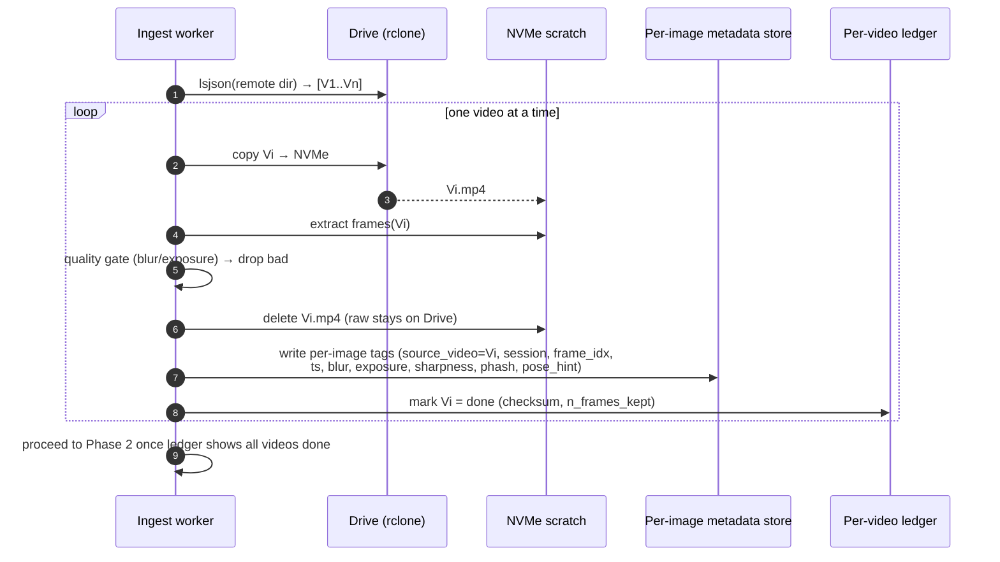
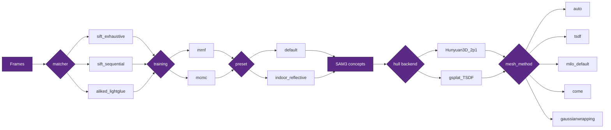
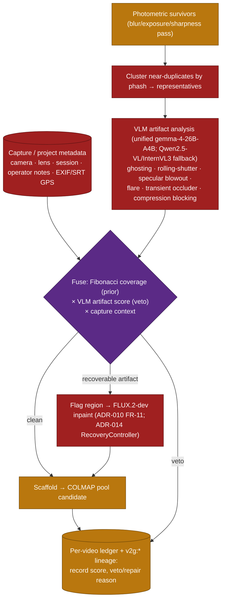

# Aspirational End-to-End Workflow — Diagram as Code

**Date**: 2026-06-04
**Status**: Target architecture (drives PRD-v3, ADR-009/010/011/012/013, DDD v3 extensions)
**Entry point** (ADR-013): a pre-run `exhibit.toml` manifest (exhibit identity + object sub-list +
Drive URL + `env:`-indirected HF/GCloud secrets) materialises `PipelineConfig`; stages run serially
behind a VRAM-bounded model lifecycle (load best model → run → unload) over the `v2g-net` docker mesh
(`comfyui` FLUX.2-dev/Hunyuan3D-2.1, `agent-vlm` = the unified multimodal **gemma-4-26B-A4B** serving
both artifact-VLM and reasoner roles; Qwen2.5-VL fallback only — ADR-013 D-013.5).
**Scope**: From a Google Drive folder of raw videos to a richly-annotated USD scene graph
with a polygonal textured environment and correctly-placed, textured 3D hulls of the
key items in the scene.

This document is the canonical picture of *what we want*. The companion
[`../decisions/gap-analysis-e2e-aspiration.md`](../decisions/gap-analysis-e2e-aspiration.md)
classifies every node below as **Implemented / Partial / Missing** against the current
code, with `file:line` evidence.

---

## 1. Full pipeline (aspiration, gap-coloured)

Node colour encodes current implementation state:
🟩 Implemented · 🟨 Partial · 🟥 Missing.

```mermaid
flowchart TD
    classDef done   fill:#1f7a3d,stroke:#0d4023,color:#ffffff;
    classDef part   fill:#b9770e,stroke:#6e4708,color:#ffffff;
    classDef miss   fill:#a02020,stroke:#5e1212,color:#ffffff;
    classDef io     fill:#143b5e,stroke:#0a1f33,color:#ffffff;
    classDef branch fill:#5b2a86,stroke:#34194d,color:#ffffff;

    %% ===================== PHASE 1: PER-VIDEO INGEST LOOP =====================
    subgraph P1["Phase 1 · Per-video ingest loop (over the remote dir)"]
        direction TB
        DRV[(Google Drive remote dir)]:::io
        LIST["List videos · rclone lsjson"]:::done
        NEXT{{"Pick NEXT single video V"}}:::miss
        COPY["rclone copy V → local NVMe scratch"]:::done
        EXTR["Extract frames from V (ffmpeg/PyAV)"]:::done
        QC{"Quality gate: blur / exposure"}:::part
        DROP["Drop bad frames"]:::done
        DELV["DELETE local video file V (retain on Drive)"]:::part
        TAG["Metadata-tag each image of V<br/>source_video · session · frame_idx ·<br/>timestamp · quality scores · pose hint"]:::miss
        LEDG[("Per-video resumable ledger")]:::part
        MORE{"More videos in remote dir?"}:::miss

        DRV --> LIST --> NEXT --> COPY --> EXTR --> QC
        QC -->|fail| DROP --> EXTR
        QC -->|pass| DELV --> TAG --> LEDG --> MORE
        MORE -->|yes| NEXT
    end

    %% ===================== PHASE 2: BRANCHING RECONSTRUCTION =====================
    subgraph P2["Phase 2 · Reconstruction (branching model choices)"]
        direction TB
        POOL["Pool tagged frames for the room/session"]:::done
        SEL["Frame selection · Fibonacci coverage (ADR-007)"]:::done
        MATCH{"SfM branch: COLMAP {SIFT | ALIKED+LightGlue*}<br/>· optional neural SfM {VGGT|MASt3R} (ADR-012)"}:::branch
        SFM["COLMAP SfM → sparse model"]:::done
        REG{"Registration ≥ 70%?"}:::part
        TRN_B{"Training branch:<br/>strategy {mrnf|mcmc} ×<br/>preset {default|indoor_reflective}"}:::branch
        TRAIN["3DGS train → Gaussian field (PLY)"]:::done
        KSPLAT["Optional splat-optimize → .ksplat (ADR-006)"]:::done
    end

    MORE -->|no| POOL --> SEL --> MATCH
    MATCH -->|exhaustive| SFM
    MATCH -->|sequential| SFM
    MATCH -->|vocab_tree| SFM
    SFM --> REG
    REG -->|no: flag re-capture| DRV
    REG -->|yes| TRN_B --> TRAIN --> KSPLAT

    %% ===================== PHASE 3: SAM3 KEY-ITEM ID =====================
    subgraph P3["Phase 3 · Key-item identification (SAM3)"]
        direction TB
        SAM3["SAM3 concept-prompted segmentation"]:::part
        RANK["KEY-ITEM selection / ranking<br/>(size · gaussian-count · confidence · concept priority)"]:::miss
        PROJ["Mask → 3D projection (depth-aware)<br/>→ per-object Gaussian subset + pose"]:::part
    end

    KSPLAT --> SAM3 --> RANK --> PROJ

    %% ===================== PHASE 4: PER-OBJECT HULL RECON =====================
    subgraph P4["Phase 4 · Per-key-item 360° hull reconstruction (branching)"]
        direction TB
        OBJ{{"For each KEY item"}}:::part
        MVR["Multiview orbit render"]:::done
        FLUX["LOCAL FLUX.2-dev inpaint unseen/occluded views (ComfyUI, ADR-012/013/014)"]:::miss
        HULL_B{"Hull backend branch"}:::branch
        H3D["Hunyuan3D 2.1 (ComfyUI) → textured GLB (ADR-012)"]:::done
        TSDF_O["gsplat depth → TSDF fallback"]:::done
        HULLTEX["Textured watertight hull + preserved world pose"]:::part
    end

    PROJ --> OBJ --> MVR --> FLUX --> HULL_B
    HULL_B -->|Hunyuan3D| H3D --> HULLTEX
    HULL_B -->|fallback| TSDF_O --> HULLTEX
    OBJ -.next item.-> OBJ

    %% ===================== PHASE 5: ENVIRONMENT MESH =====================
    subgraph P5["Phase 5 · Environment mesh (branching backend, ADR-003)"]
        direction TB
        ENV_B{"mesh_method branch:<br/>auto|tsdf|milo*|come|gaussianwrapping<br/>(*MILo default — ADR-012)"}:::branch
        ENVMESH["Polygonal textured ENVIRONMENT mesh"]:::miss
    end

    KSPLAT --> ENV_B
    ENV_B -->|auto/tsdf/milo/come/gw| ENVMESH

    %% ===================== PHASE 6: USD SCENE GRAPH =====================
    subgraph P6["Phase 6 · USD scene graph (richly annotated)"]
        direction TB
        ASM["Assemble USD stage graph"]:::part
        ENVN["/World/Environment ← textured env mesh"]:::miss
        OBJN["/World/Objects/obj_NN<br/>variantSet representation {Gaussian|Mesh}"]:::done
        PLACE["Place hulls at surveyed/world pose (xform)"]:::part
        META["RICH per-node metadata:<br/>semantic label · quality · bbox · gaussian_count ·<br/>recon method · confidence · timestamps · video lineage"]:::miss
        MATS["Bind UsdPreviewSurface materials + textures"]:::done
        CAMS["/World/Cameras (COLMAP intrinsics/extrinsics)"]:::done
        VAL{"Validate: USD present & object_count > 0"}:::done
        DELIV[("Deliverable: USD scene graph + .ksplat + GLB hulls")]:::io
    end

    HULLTEX --> ASM
    ENVMESH --> ASM
    ASM --> ENVN --> OBJN --> PLACE --> META --> MATS --> CAMS --> VAL --> DELIV
```

---

## 2. Phase-1 control flow (per-video loop, exact order)

The user's stated order is **extract → quality-check → delete the local video → tag the
images → next video**. The current ingestor does none of this per-video; it pools an
entire folder of videos and deletes only after the whole reconstruction completes.

---

## 3. Branch map (model choices as a decision tree)

> **SOTA defaults (ADR-012):** matcher → `aliked_lightglue` for indoor presets (SIFT fallback);
> hull → `Hunyuan3D 2.1`; inpaint → `FLUX.2-dev` (ADR-013, amended from Kontext); `mesh_method` default → `milo` (TSDF only
> on sidecar-down); optional neural SfM (`VGGT`/`MASt3R`) precedes COLMAP for low-overlap captures.

---

## 4. Legend & reading guide

| Colour | Meaning | Source of truth |
|--------|---------|-----------------|
| 🟩 Implemented | Code exists and serves the aspiration | gap analysis, `file:line` |
| 🟨 Partial | Mechanism exists but scope/wiring/data is incomplete | gap analysis |
| 🟥 Missing | No code path serves this node | gap analysis |
| 🟪 Branch | A configurable model/algorithm choice point | `config.py` |
| 🟦 I/O | External boundary (Drive, deliverable) | — |

The four hardest-hitting 🟥 nodes — **per-video loop**, **per-image metadata tagging**,
**key-item ranking + FLUX-inpainted hull recon**, and **rich USD node metadata** — are the
spine of PRD-v3 and ADR-009/010/011.

---

## 5. VLM artifact analysis & metadata-aware candidate scaffolding (ADR-012, T8)

A second, **semantic** quality pass the containerised agent runs on the photometric survivors of
Phase 1, fusing a VLM `artifact_report` with the per-frame metadata to scaffold reconstruction
candidates. The agent **annotates and ranks — it never silently drops**; every veto/repair reason
is recorded in the ledger and carried as `v2g:*` lineage.

The VLM stage requires a model pull (HF token + accepted licences); see ADR-012 §D-012.5 and
PRD-v3 FR-27/FR-28. It is additive — the cheap photometric gate stays the first pass.
